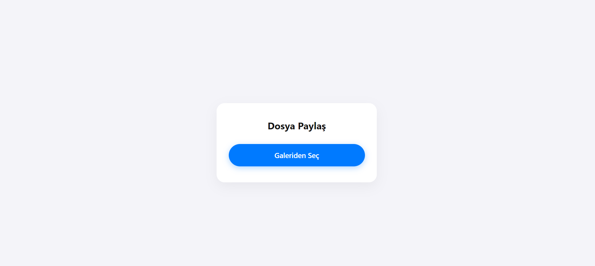
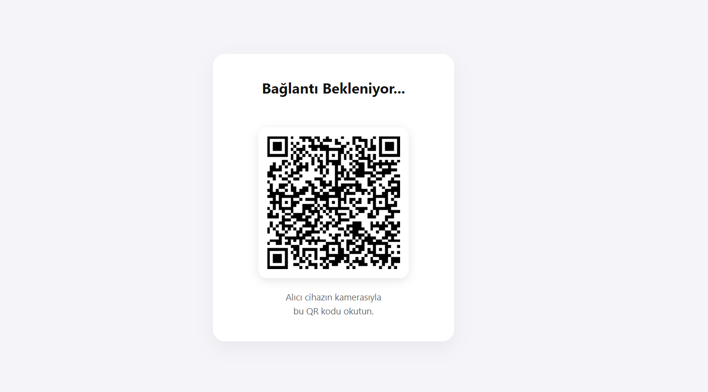
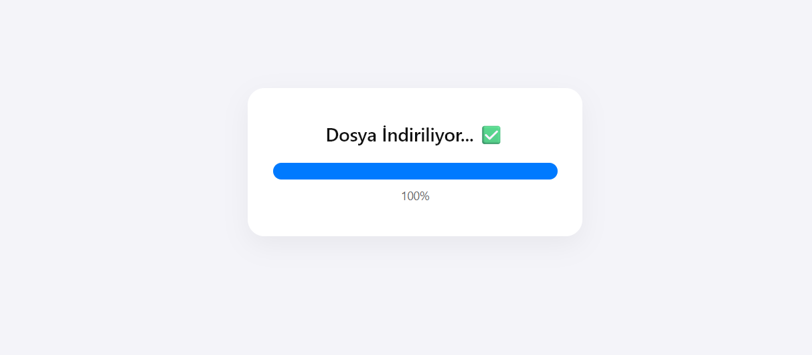

<div align="center">
  <h1>🚀 QCT: QR Code Transfer</h1>
  <br><br>
  <p>
    <strong>A blazing-fast, secure, and local-first Peer-to-Peer file transfer web application.</strong>
  </p>
  <p>
    <em>Bypass the cloud and send files directly between devices on the same network with zero file size limits!</em>
  </p>
</div>

---

## 🚀 Features

- **100% Peer-to-Peer:** Files are transferred directly between devices using WebRTC Data Channels. They are **never** uploaded to or stored on our server.
- **RAM-Safe Large File Transfer:** Overcomes mobile browser limitations! Incoming ArrayBuffer chunks are directly piped to `IndexedDB` in real-time, preventing crashes when transferring multi-gigabyte files.
- **QR Code Pairing:** Connect instantly. The sender creates a secure room, and the receiver joins by simply scanning a dynamically generated QR code (or by clicking the link).
- **Smart Wake Lock:** Implements the Wake Lock API and visibility state listeners to keep the screen awake and prevent the connection from dropping during large transfers.
- **Privacy-First "Kamikaze Protocol":** Any disconnection, page refresh, or connection loss instantly destroys the room on the backend, forcefully closes all WebRTC tunnels, and wipes local memory/IndexedDB clean.
- **High Security:** Rooms are strictly limited to two participants (1 Sender, 1 Receiver) to prevent Man-in-the-Middle (MITM) attacks. Disconnected links are permanently blacklisted (403/404).

---

## 🛠 Tech Stack

- **Frontend:** Vanilla JavaScript, HTML5, CSS3, WebRTC API, IndexedDB API, Wake Lock API.
- **Backend (Signaling):** Python, Django, Django Channels (WebSockets).
- **In-Memory Store:** Redis (for fast, ephemeral room and state management).

---

## ⚙️ How it Works

QCT acts entirely as a **signaling server** and not a file server. Here is the lifecycle of a transfer:

1. **Signaling & Connection:** The Django backend (via Django Channels) facilitates the initial WebRTC "handshake" (SDP offers/answers and ICE candidates). 
2. **Direct P2P Link:** Once the WebRTC tunnel is established, the server steps back. The data flows 100% between the two peers.
3. **Chunking & Reassembly:** The sender's browser reads the file in chunks and sends them over the WebRTC Data Channel. The receiver's browser temporarily stores these chunks in `IndexedDB`.
4. **The "Kamikaze Protocol":** If the WebSocket connection is interrupted or either user navigates away:
   - The Django server deletes the room state from Redis.
   - Any further attempt to access the room returns a `404` or `403`.
   - The frontend immediately clears all variables and purges partial chunks from `IndexedDB`.

---

## 📸 Screenshots

| Main View | Sender View | Receiver View |
| :---: | :---: | :---: |
|  | |  |
|*Sender selects a file.* | *The sender generates a unique QR code and waits for the receiver to scan and join the room.* |  *Receiver scans the QR code and accepts the transfer.* |

---

## 💻 Local Installation & Setup Guide

Since QCT is a local-first application, here is how you can set it up on your own machine.

### Prerequisites

- Python 3.8+
- Redis Server (Running locally or via Docker)

### Steps

1. **Clone the repository:**
   ```bash
   git clone https://github.com/TalhaSeyfeli/QCT.git
   cd QCT
   ```

2. **Set up a Virtual Environment:**
   ```bash
   python -m venv venv
   # On Windows
   venv\Scripts\activate
   # On macOS/Linux
   source venv/bin/activate
   ```

3. **Install Dependencies:**
   ```bash
   pip install -r requirements.txt
   ```

4. **Start the Redis Server:**
   Ensure Redis is running on `localhost:6379`. If using Docker:
   ```bash
   docker run -p 6379:6379 -d redis
   ```

5. **Run the Signaling Server:**
   To allow devices on your local network to connect, run the server bound to `0.0.0.0`:
   ```bash
   python manage.py runserver 0.0.0.0:8000
   ```

> [!NOTE]
> Find your computer's local IPv4 address (e.g., `192.168.1.50`). Other devices on the same Wi-Fi network can connect by visiting `http://192.168.1.50:8000`.

---

## 📱 Usage Instructions

### For the Sender:
1. Open the app (`http://<your-ip>:8000`) on your computer or phone.
2. Click **Create Room** / **Send File**.
3. Select the file you wish to send.
4. A QR Code and a Share Link will be generated. Keep this screen open!

### For the Receiver:
1. Scan the QR code using your phone's camera, OR open the provided link on another device.
2. The WebRTC connection will establish automatically.
3. Accept the incoming file transfer.
4. Keep the tab active. The Wake Lock API will prevent your screen from sleeping. Once the transfer reaches 100%, the file will be reassembled and downloaded automatically.

---

## 💡 Optional: Remote Testing (Over the Internet)

Want to test QCT with someone not on your Wi-Fi network? You can use tunneling tools like [ngrok](https://ngrok.com/) to expose your local server securely:

```bash
ngrok http 8000
```
Simply share the generated `https://` ngrok URL with the receiver!

*(Note: WebRTC over WAN might require STUN/TURN servers to bypass strict NATs/Firewalls. See the Roadmap below.)*

---

## 🗺️ Roadmap & Future Plans

- [x] Basic signaling with Django Channels
- [x] Local network P2P transfer (WebRTC)
- [x] RAM-safe streaming via IndexedDB
- [x] "Kamikaze" disconnection security
- [x] QR code generator integration
- [ ] STUN/TURN integration for reliable WAN transfer
- [ ] Multi-file selection queue
- [ ] Pause & Resume functionality
- [ ] UI/UX polish (Animations, glassmorphism)

---
